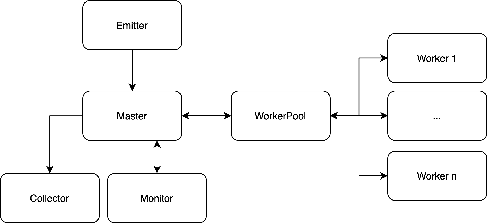
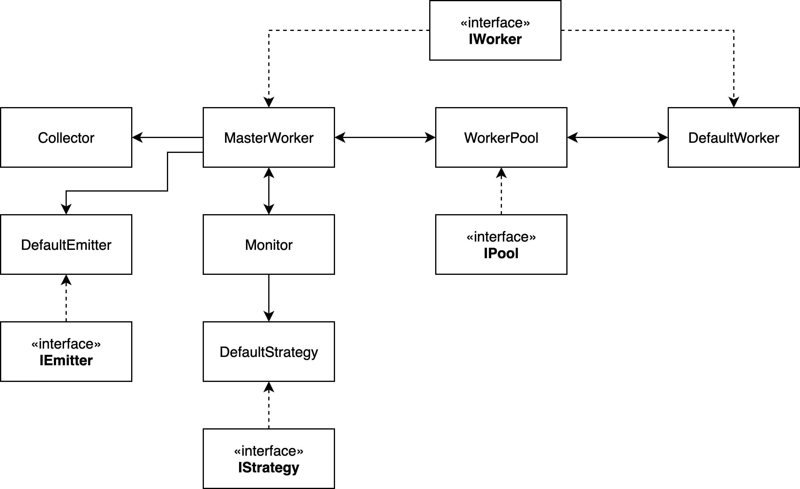
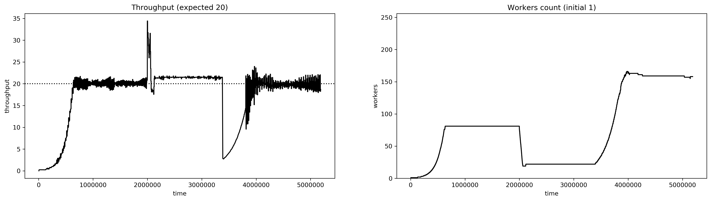

# Autonomic Farm parallel pattern

This project involves the implementation of a farm that can increment or decrement the number of workers to achieve a constant service time, provided as input.

## Parallel architecture design

The parallel architecture design follow the classic master-worker pattern.

The master worker schedules all the input tasks the workers, that once completed notifies it back. 
Every time a task gets collected by the master, it will notify the monitor and the collector. The collector simply stores all the computed results from workers, while the monitor takes care of computing the current throughput and deciding whether is better or not to add or remove a worker. If so, the monitor sends the command(s) to the master that will act accordingly. 

If a worker isn’t needed anymore, it is removed from the pool of the available workers, so if the monitor decides that it will be needed in future it simply gets added again to the pool, without any need to spawn the worker again. I decided to insert also another entity, the WorkerPool, that lies between the workers and the master. 

The master indeed does not interact directly with the workers, but rather with the WorkerPool which is in charge of finding a free worker and manage its termination together with adding or removing a worker. The master is actually a container that orchestrates the flow of data between all the other entities.

### UML

## Sample performance 

The following plot is obtained by running the farm on a KNL machine with 256 physical cores. The input consists in a vector of 90000 tasks to compute divided in three sections: the first requires 4ms per task, the central one 1ms and the latter 8ms.

More benchmarks are available in the [report.pdf](./report.pdf) file.